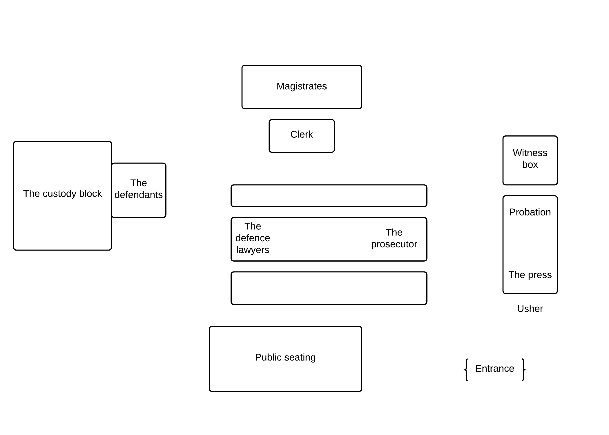

\documentclass{report}
\usepackage{graphicx} 

\begin{document}
\begin{titlepage}
    \centering
    \vfill
    {\bfseries\Large
        \vskip2cm
        A. Uthor\\
    }    
    \vfill
    \includegraphics[width=4cm]{images/court-room.jpg} % also works with logo.pdf
    \vfill
    \vfill

\newpage

#Formal Report on City Link's prosecution under Trade Union and Labour Relations(Consolidation) Act 1992#

##Details of the court##
Coventry Magistrates Court  
60, Little Park Street,  
Coventry,  
CV1 2SQ

Attended Friday 6th November (1:20 - 5:30)  
Total time spent in court building: 4 hours 10 minutes  
Total time spent within the court rooms: 3 hours 30 minutes  
Courtroom 3

\newpage

##Diagram of Court Room 3##

\newpage

##Introduction to the case##
Three ex-directors of the former firm 'City Link' were prosecuted under the 
Trade Union and Labour Relations(Consolidation) Act of 1992 after failing to give 
the Secretary of state notice 90 days before announcing nearly 3000 job losses 
following the collapse of the firm in 2013. 

This was the second day of the trial, and consequently the first director had
already been questioned.

##Details on the case##
There were three defendants being prosecuted: David Smith, Robert Peto and
Thomas Wright, all ex-directors of City Link, the managing director, the
financial director and a non-executive director respectively.
The case began with the room standing in respect to the Judge as he entered.
Shortly after this, the first of the three defendants was called to the stand to
answer questions. Once there, he took an oath to only speak the truth. The first
defendant was the ex-City Link financial director, a middle aged man called
Robert Peto. He was asked to keep his eyes on the judge when listening and
responding to questions. Throughout his questioning, the lawyers made it very
clear to include the phrase: "to your understanding", meaning that the
defendants could only answer to the best of their knowledge, and wouldn't be
lying if something they believed to be true was in fact incorrect or factually
inaccurate. 

A single magistrate heard the case, a white British male of approximately 50
years of age.

The key point during the case was whether the company knew that the jobs would
have been lost when the company went into administration. If so, then the
directors would have been breaking the law by not notifying the Secretary of
selling a business through administration can mean dropping some of its
liabilities. 

##Outcome of the case##
The three directors were found not guilty of the charges against them, the judge
deciding that they had demonstrated their intent to try and revive the company,
and therefore their innocence on failing to notify the Secretary of State about
the forthcoming redundancies that were to follow the collapse of the company.

\newpage

#Operation of laypersons within the English legal system, and the general operation of Juries#
##Brief overview of the court system##
In order to save time later, here is an outline/overview of some important
working within the legal system.

The law can be split into two distinct categories: public, and private/civil
law. Public issues may be constitutional/administrative, criminal or revenue
cases. Private/civil law may concern family, employment or land. Depending on
which category a case is placed, will determine who hears the case. Magistrates courts
will hear less severe cases, and have the power to sentence a maximum of six
months in prison, and/or up to a £5000 fine. Offences such as motoring offences,
or disorderly behaviour can **only** be heard in a magistrates court **(Gov.uk
2015)**. Often, the severity of the crime will determine in which court the defendant
shall be tried.

County courts tend to listen to cases not involving family disputes or criminal
offences, and are sometimes known as 'small-claims courts'.

Cases deemed too severe for the magistrates court will be dealt with by the Crown
Court. These cases may involve murder, robbery or rape. Cases such as these can
**only** be heard in a crown court. Despite this, there are some offences, known
as 'either-way offences', which can be heard in either a magistrates court, or a
crown court. This is when the severity of the crime determines the audience. A
magistrates court also may pass on a case to the crown court, when it feels a
punishment more severe than that which it can delegate is required.

Then there is the Court of Appeal. Once a case finishes in a crown
court, magistrates court or county court, either party may appeal the decision that was made.
This can result in a lighter penalty, but also may result in a heavier one if
the judge/jury see fit. The Supreme Court is the highest level of court of
appeal, and occupies the role that was formerly taken by the House of Lords.

##Section 1 - Laypersons##

###What are laypersons?###
The English legal system makes use of what are known as 'laypersons'. "A
layperson is a member of the public seeing openly court procedures, thereby
maintaining public confidence in the system" **(Vollans & Asquith 13 January
2011: 128)**.

###When are they used?###
Laypersons are used primarily as:   

 - Lay magistrates
 - Members of a jury

They also play roles as:  

 - Tribunals
 - Arbitrators

Assessors are laypersons, independent of either party in  a case, with a relevant field of 
expertise, brought in to witness the  case to ensure its content is accurate and 
correct with regards to their field indicated by **s70 (1) Supreme Court Act 1981**.

When treated with cases dealing with determining causes of unclear or suspicious
deaths or accidents, a local authority may appoint a coroner. Eligibility to be a coroner is
a minimum of 5 years experience in the role as a lawyer or a doctor. **(Vollans
& Asquith 2011: 156)**

A maximum of two lay members may sit with a legally qualified chairman assisting
with the judgements on a tribunal. They will have a background knowledge and/or
experience in the matter presented before the tribunal. **(Vollans & Asquith
 2011: 161)**

The two parties involved in a case may together appoint an arbiter, someone with
background knowledge/experience in the relevant field to the case. This person
would sit isolated, and make judgements and decisions based on the evidence
presented along with their own knowledge of the subject. **(Vollans & Asquith 13
January 2011: 163)**

Another role laypersons can play within the legal system, is being a member of a
jury.

##Section 2 - Juries##
###What is a Jury?###
A jury is a group of people, summoned to sit in upon a case, and come to a
unanimous verdict.
The purpose of a jury is to try and provide a completely unbiased audience to a
trial, who independently give a verdict.
Although size may vary, for any serious felonies, there will usually be 12 jurors.

A jury cannot decide a sentence to award a criminal, but they can decide the
verdict, and they can also award the level of damages.

"The members of a jury are selected without regard to any skill, and the brief
duration of their service prevents them from acquiring the kind of experience
which justices of the peace or members of a tribunal will amass with time."
**(Cornish 1968: 13)** Therefore, in theory, a jury should be a representative
group of society, with no common skill set. They are not likely to be legally trained, and
therefore should give an unbiased verdict. However, this is not always the case.

Firstly (as stated in the following section), one must be registered on the
electoral roll to be eligible to serve on a jury. It could be argued that
certain cultures/groups in society may not sign up to vote, whether that is
through their morals/ethics, or simply not wanting to be in a government
database. Another problem with the system, is that it has been known for jurors
to show sympathy for the defendants, for example the extremely high damages
rewarded to Elton John after being subject to defamation.

A member of a jury is forbidden to share any information that they may have
heard within a case, with anybody except the judge, and the bailiff, as per
**section 8 (1) Contempt of Court Act 1981**.

Within criminal cases, a jury not only decides the guilt or innocence of the
defendant, but also whether or not they were provoked, acting in self-defence or
acting under diminished responsibility and whether the force used was
reasonable **(Vollans & Asquith 2011: 175)**. This gives the jury an enormous
amount of responsibility.

###Jury Qualification###
If you are registered on the electoral roll, you are probably eligible to serve
as a member of a jury, indicated by **s1(a)** of the **Juries Act 1974**. The
same act states you must be ordinarily resident in the UK, Isle of Man or the
Channel Islands for a minimum of 5 years after turning 13. They must also be of
the age of 18 and above, but no more than 70. They are not eligible to serve if
they are:

 - A mentally disordered person
 - Disqualified from jury service  

**(Juries Act 1974)**

###History of juries###
The origins of a jury can be traced back to 1066, at the time of the Norman
conquering. W.R Cornish suggests  that it "is rather more likely that the
Normans inherited the jury concept as an existing English institution" **(Cornish
1968: 13)**. It is
known that the Magna Carta 1215 officially recognized the right to a jury within
the English legal system **(Vollans & Asquith 2011)**.
Since the nineteenth century, the use civil juries has declined, after judges
were awarded the power to refuse a case to be heard by a jury as per
**Administration of Justice (Miscellaneous Provisions) Act 1933**. Today, less than 1%
of civil cases are heard by a jury.**(Vollans & Asquith 2011: 45)**

\newpage

#References#
Cornish, W., R. (1968) *The Jury* Great Britain: Allen Lane The Penguin Press.

Gov.uk (2015) *How the courts work* [online] available from
<http://open.justice.gov.uk/how-it-works/courts> [9 October 2015]

Vollans, T., and Asquith, G. (2011) *English Legal System*. 2nd edn. Coventry:
Concentrate.

\end{titlepage}
\end{document}
